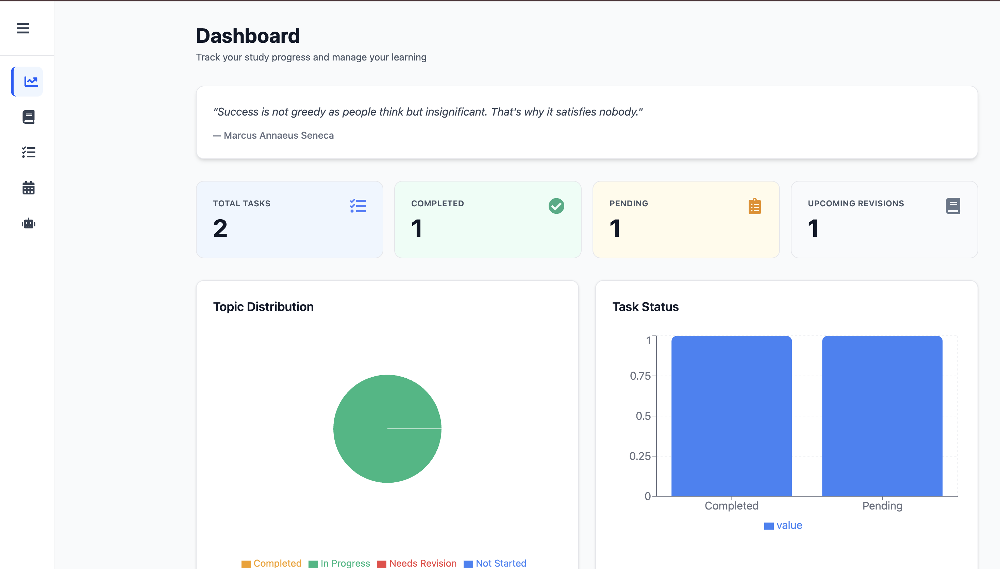

📋 Project Details  
Submission by: Kartik Gupta  
Roll No: 25BCS10035  
Student Mail Id: kartik.25bcs10035@sst.scaler.com  
Submitted to: Mrinal Bhattacharya

# AI Powered Study Companion (StudyMate)

A modern React-based study management platform that helps students organize subjects/topics, manage tasks, plan revisions, and use AI-powered study assistance (summaries, questions, flashcards, and study plans).

## 1. Project Overview

This project is built as a personal study operating system for students. It combines:

- Structured planning (Subjects, Topics, Tasks, Revisions)
- Progress analytics (stats + charts + weekly activity)
- AI content generation tools for faster preparation
- Persistent browser storage for offline continuity

The app follows a clean SaaS-style UI with a left sidebar, responsive layouts, and form-driven workflows.

## 2. PRD Coverage Analysis

The project implements the PRD goals with strong coverage and some evolved behavior based on final product decisions.

### Covered Features

- Subject management (create, edit, delete)
- Topic management per subject (create, edit, delete)
- Task management (create, edit, delete, complete)
- Dynamic search across subjects/topics/tasks
- Task filtering (priority, subject, deadline window)
- Task sorting (due date, priority, subject)
- Dashboard with:
  - Total, completed, pending, upcoming revision metrics
  - Topic distribution pie chart
  - Task status bar chart
  - Weekly activity bar chart
  - Upcoming revision reminders
- Revision planner with subject-aware topic selection
- AI tools:
  - Summary generator
  - Practice questions generator
  - Flashcards generator
  - Study plan generator
- Loading and error fallback behavior for motivational quote API

### Product Evolution vs Original PRD

- Original PRD task status/tabs included a Revision status.
- Final implementation separates revisions into a dedicated Revision Planner page and removes Revision from task statuses/tabs.
- Dashboard revision metrics now come from revision schedules rather than task status.

This aligns better with clean information architecture: Tasks handle execution workflow, Revision page handles spaced repetition workflow.

## 3. Core Pages and Behavior

### Dashboard (/dashboard)

- Motivational quote with loading skeleton and fallback quote handling
- KPI cards:
  - Total Tasks
  - Completed
  - Pending
  - Upcoming Revisions
- Charts:
  - Topic Distribution (pie)
  - Task Status (bar)
  - Weekly Activity (bar)
- Progress bar for completion percentage
- Upcoming revisions list sorted by nearest date

### Subjects (/subjects)

- Subject CRUD with validation
- Topic CRUD under selected subject
- Search across both subject and topic content
- Topic fields:
  - Name
  - Difficulty (Easy/Medium/Hard)
  - Status (Not Started/In Progress/Completed/Needs Revision)
  - Notes
- Edit mode pre-fills forms and hides currently editing card from list

### Tasks (/tasks)

- Task CRUD with validation
- Subject-topic dependency in form:
  - Topic select disabled until subject is selected
  - Topic options limited to selected subject only
- Status options:
  - Pending
  - Completed
- Tabs:
  - All
  - Pending
  - Completed
  - Overdue
- Filtering by priority, subject, deadline window
- Sorting by due date, priority, subject
- Completing task sets completion timestamp used by weekly analytics

### Revision (/revision)

- Subject-aware revision scheduling form
- Topic options filtered by selected subject
- Revision date scheduling
- Mark revision complete
- Delete revisions
- Revision tips + spaced repetition interval guidance

### AI Tools (/ai-tools)

- AI-powered content generation using OpenAI Chat Completions API
- Four tools:
  - Summary
  - Questions (count configurable)
  - Flashcards (count configurable)
  - Study Plan
- Output panel with:
  - Copy to clipboard
  - Download as text file

## 4. Weekly Activity Chart Logic (Important)

Weekly Activity represents completed tasks for the last 7 days.

Computation logic:

1. Build a 7-day timeline from today (oldest to newest)
2. For each day, count only tasks where status is Completed
3. Date source per task:
   - Prefer completedAt
   - Fallback to deadline if completedAt is absent
4. Match by calendar day and aggregate counts

Practical implication:

- If completed tasks have dates outside the last 7 days, bars show 0.
- If a task is marked Completed from form/action, completion date tracking is used to reflect activity accurately.

## 5. Tech Stack

- Frontend: React 19 + Vite
- Styling: Tailwind CSS v4
- Routing: react-router-dom
- Forms and Validation: react-hook-form + yup + @hookform/resolvers
- Charts: recharts
- Date utilities: date-fns
- Notifications: react-toastify
- Icons: react-icons
- HTTP client: axios
- Motion package available: framer-motion

## 6. State Management and Data Persistence

### Global State

Context API via StudyContext stores:

- subjects
- topics
- tasks
- revisions

### Persistence

Data is persisted in localStorage with these keys:

- study_subjects
- study_topics
- study_tasks
- study_revisions

Data auto-loads on app start and auto-saves on state changes.

## 7. Folder Structure

```text
src/
  Assets/
    Demo.png
  components/
    Navbar.jsx
    ProgressChart.jsx
    RevisionList.jsx
    SearchBar.jsx
    SubjectCard.jsx
    TaskCard.jsx
    Sidebar.jsx
  context/
    StudyContext.jsx
  hooks/
    useDebounce.js
    useProgress.js
    useSubjects.js
    useTasks.js
  pages/
    AITools.jsx
    Dashboard.jsx
    DataManager.jsx
    Revision.jsx
    Subjects.jsx
    Tasks.jsx
  services/
    aiService.js
  utils/
    helpers.js
    storageManager.js
  App.jsx
  App.css
  index.css
  main.jsx
```

Note: DataManager utilities exist in codebase but page route is currently not included in the app navigation.

## 8. Environment Variables

Create a .env file in the project root:

```env
VITE_OPENAI_API_KEY=your_openai_api_key
VITE_API_NINJAS_KEY=your_api_ninjas_key
```

Used by:

- OpenAI API (summaries/questions/flashcards/study plan)
- API Ninjas quotes endpoint (motivational quote)

If quote API fails, app falls back to a default quote.

## 9. Installation and Run

```bash
npm install
npm run dev
```

Production build:

```bash
npm run build
npm run preview
```

Lint:

```bash
npm run lint
```

## 10. Key Architectural Notes

- Reusable hooks encapsulate business logic:
  - useTasks
  - useSubjects
  - useProgress
  - useDebounce
- UI components are modular and page-agnostic where possible
- Forms use schema-driven validation for consistency
- Dashboard metrics are computed centrally in useProgress for single source of truth

## 11. Data Models

### Subject

```json
{
  "id": "string",
  "name": "string",
  "description": "string",
  "color": "string"
}
```

### Topic

```json
{
  "id": "string",
  "subjectId": "string",
  "name": "string",
  "difficulty": "Easy | Medium | Hard",
  "status": "Not Started | In Progress | Completed | Needs Revision",
  "notes": "string"
}
```

### Task

```json
{
  "id": "string",
  "title": "string",
  "subject": "string",
  "topic": "string",
  "deadline": "date",
  "priority": "Low | Medium | High",
  "status": "Pending | Completed",
  "completedAt": "date | null"
}
```

### Revision

```json
{
  "id": "string",
  "subject": "string",
  "topic": "string",
  "revisionDate": "date",
  "completed": "boolean",
  "completedAt": "date | undefined"
}
```

## 12. UX Highlights

- Sidebar navigation with collapsible behavior
- Minimal neutral visual language with soft shadows and consistent spacing
- Dynamic form behavior for dependent selects (subject -> topic)
- Loading skeleton for quote section to improve perceived responsiveness
- Chart cards with hover lift/shadow interactions
- Toast feedback for CRUD and AI actions

## 13. Limitations and Future Enhancements

- AI generation quality depends on API key/model access and quota
- No backend sync (data is browser-local only)
- DataManager page is present but not currently routed
- Additional enhancements possible:
  - Authentication and cloud sync
  - Dark mode
  - PDF export for AI outputs
  - More advanced analytics (subject-wise trend lines)

## 14. Final Note

This project demonstrates a complete React architecture with practical state design, form validation, chart-based analytics, and real AI API integration for a production-like study planning workflow.

## 15. License

This project is created for educational purposes as part of coursework.

## 16. Developer

Kartik Gupta  
Roll No: 25BCS10035  
Email: kartik.25bcs10035@sst.scaler.com

## 17. Acknowledgments

- Mrinal Bhattacharya - Course Instructor
- OpenAI - AI text generation API
- API Ninjas - Motivational quotes API
- React Team - Excellent documentation
- Vite - Blazing fast tooling
